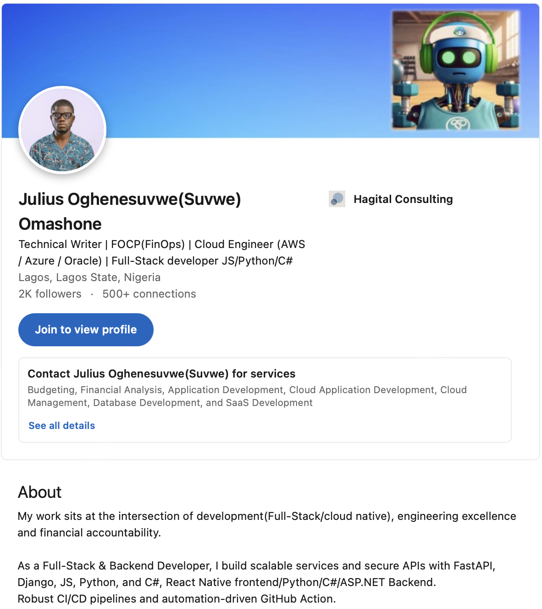

# Oghenesuvwe Omashone

**Cloud Architect | FinOps Strategist | Technical Writer | Full-Stack Engineer**

Welcome to my professional portfolio, a showcase of my expertise in cloud architecture, financial operations optimization, and full-stack development.

## 🌐 Live Portfolio

**[View Portfolio →](https://portfolioreadme.netlify.app)**

## 👨‍💻 About Me

I'm a versatile technology professional based in Nigeria, specializing in:

- **Cloud Architecture**: Designing scalable, secure, and cost-efficient solutions across AWS, Azure, and Oracle Cloud
- **FinOps Strategy**: Optimizing cloud spending and implementing financial governance frameworks
- **Technical Writing**: Creating comprehensive documentation, tutorials, and technical content
- **Full-Stack Development**: Building robust applications with Python, C#, and modern web technologies

## 🏆 Key Achievements

- **FinOps Certified Practitioner (FOCP)** - Financial operations expertise
- **Oracle Cloud Infrastructure 2025 Certified** - Latest cloud infrastructure knowledge
- **Microsoft Guinness World Record Holder** - AI learning achievement
- **AWS Well-Architected Proficient** - Cloud architecture best practices

## 🛠️ Technical Expertise

**Cloud Platforms**: AWS, Microsoft Azure, Oracle Cloud Infrastructure  
**Programming**: Python, C#, .NET, JavaScript, TypeScript  
**Infrastructure**: Terraform, Docker, Kubernetes, Helm  
**Analytics**: Power BI, SQL, Excel Dashboards, Google Sheets  
**DevOps**: GitHub Actions, Azure DevOps, CI/CD Pipelines  

## 📊 FinOps & Analytics Tools

- Power BI for cloud cost visualization
- Google Sheets for financial modeling
- Excel dashboards for executive reporting
- SQL for data analysis and optimization
- Custom Python scripts for cost automation

## 📞 Let's Connect

- **Email**: [Oghenesuvweomashone@proton.me](mailto:Oghenesuvweomashone@proton.me)
- **LinkedIn**: [oghenesuvwe-omashone](https://www.linkedin.com/in/oghenesuvwe-omashone)
- **Credly**: [View Certifications](https://www.credly.com/users/oghenesuvwe-dev)
- **Portfolio**: [portfolioreadme.netlify.app](https://portfolioreadme.netlify.app)

---

*Transforming businesses through strategic cloud architecture and financial optimization.*